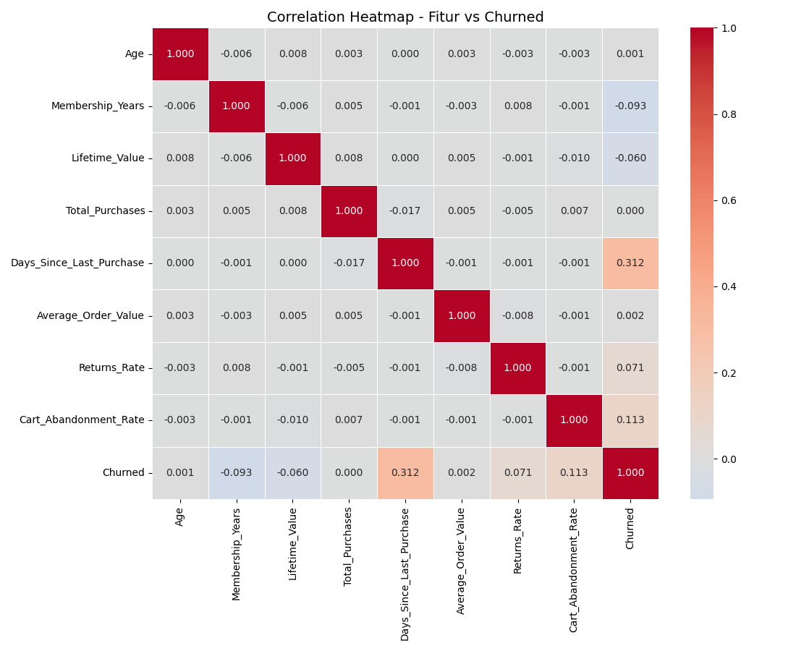

# Customer Churn Prediction by Random Forest

## Project Overview

This project aims to predict customer churn using Machine Learning.

The model is built using:

- Random Forest Classifier
- SMOTE (handling imbalanced data)
- GridSearchCV
- Threshold Tuning

The goal is to identify customers who are likely to churn so businesses can take preventive retention strategies.

---

# Dataset Information

Features used:

- Age
- Membership Years
- Lifetime Value
- Total Purchases
- Days Since Last Purchase
- Average Order Value
- Returns Rate
- Cart Abandonment Rate

Target:
- Churned (0 = No, 1 = Yes)

---

# Machine Learning Pipeline

1. Data Cleaning
2. Exploratory Data Analysis (EDA)
3. Baseline Random Forest
4. SMOTE Oversampling
5. Hyperparameter Tuning
6. Threshold Tuning
7. Model Evaluation

---

# Model Performance

## Baseline Model

| Metric | Score |
|---|---|
| Recall | 0.13 |
| F1-Score | 0.21 |
| ROC-AUC | 0.72 |

---

## Tuned Model

| Metric | Score |
|---|---|
| Recall | 0.87 |
| F1-Score | 0.45 |
| ROC-AUC | 0.72 |

---

# Key Insight

- Customers with high Days Since Last Purchase tend to churn.
- High Cart Abandonment Rate indicates churn risk.
- Recall improvement is important because detecting churn customers is the main business objective.

---

# Business Recommendation

- Send retention promotions to high-risk customers.
- Create personalized email campaigns.
- Offer loyalty rewards for inactive users.
- Monitor customer activity regularly.

---

# Technologies Used

- Python
- Pandas
- NumPy
- Matplotlib
- Seaborn
- Scikit-Learn
- Imbalanced-Learn

---
## Correlation Heatmap

 
# Author

Christians Steven Zoe 
